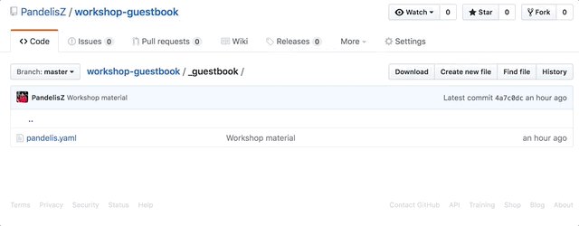
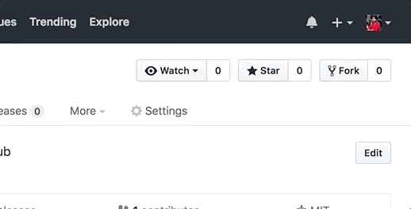
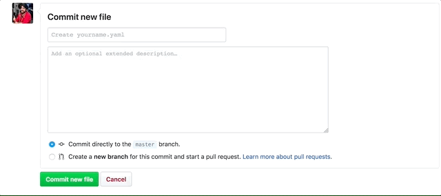

# INFCON 2022 방명록 🥳

안녕하세요! 인프콘에 오신 여러분을 환영합니다. <br />
IT인의 축제 인프콘에서 방명록을 남기고 서로 네트워킹해보세요.

아래 설명을 차근차근 따라오시다보면 PR(Pull Request)도 어렵지 않아요!<br />여러분이 작성한 PR이 `merge` 되면, INFCON 2022 방명록에 인사말이 등록됩니다.

## ◼︎ 방명록 등록 방법 요약 
1. [[Fork 하기]](https://github.com/inflearn/infcon2022-guestbook/fork)
2. [[변경 사항 만들기(방명록 추가하기)]](../../new/master?filename=_guestbook/yourname.yaml&value=---%0Aname%3A%20%EC%9D%B4%EB%A6%84%0Aimage%3A%20https%3A%2F%2Favatar.tobi.sh%2Ftobiaslins.svg%3Ftext%3DINF%0Aemoji%3A%20%F0%9F%A5%B3%0Amessage%3A%20%EC%9D%B8%EC%82%AC%EB%A7%90%0Afacebook%3A%20%EA%B3%84%EC%A0%95%20%EC%95%84%EC%9D%B4%EB%94%94%20%2F%20%EC%97%86%EC%9C%BC%EB%A9%B4%20%ED%95%B4%EB%8B%B9%20%EB%9D%BC%EC%9D%B8%20%EC%82%AD%EC%A0%9C%ED%95%98%EC%85%94%EB%8F%84%20%EB%90%A9%EB%8B%88%EB%8B%A4.%0Atwitter%3A%20%EA%B3%84%EC%A0%95%20%EC%95%84%EC%9D%B4%EB%94%94%20%2F%20%EC%97%86%EC%9C%BC%EB%A9%B4%20%ED%95%B4%EB%8B%B9%20%EB%9D%BC%EC%9D%B8%20%EC%82%AD%EC%A0%9C%ED%95%98%EC%85%94%EB%8F%84%20%EB%90%A9%EB%8B%88%EB%8B%A4.%0Agithub%3A%20%EA%B3%84%EC%A0%95%20%EC%95%84%EC%9D%B4%EB%94%94%20%2F%20%EC%97%86%EC%9C%BC%EB%A9%B4%20%ED%95%B4%EB%8B%B9%20%EB%9D%BC%EC%9D%B8%20%EC%82%AD%EC%A0%9C%ED%95%98%EC%85%94%EB%8F%84%20%EB%90%A9%EB%8B%88%EB%8B%A4.%20%0A%2F%2F%20github%20%EA%B3%84%EC%A0%95%EC%95%84%EC%9D%B4%EB%94%94%EB%8A%94%20%EB%B3%B8%EC%9D%B8%20%ED%94%84%EB%A1%9C%ED%95%84%20%ED%8E%98%EC%9D%B4%EC%A7%80%20URL%EC%97%90%EC%84%9C%20%ED%99%95%EC%9D%B8%ED%95%98%EC%8B%A4%EC%88%98%20%EC%9E%88%EC%8A%B5%EB%8B%88%EB%8B%A4.%20e.%20g.%20https%3A%2F%2Fgithub.com%2F%7B%7Bid%7D%7D%0A---)
3. 커밋 메세지 작성
4. [[풀 리퀘스트]](../../../infcon2022-guestbook/compare)
----------
## ◼︎ 방명록 양식(**방명록 파일 생성 단계**에서 필요합니다. 중요!)
```
---
name: {{이름}}
image: https://avatar.tobi.sh/tobiaslins.svg?text={{이니셜}} or 사용하고 싶은 이미지 링크
emoji: {{이모티콘}}
message: 인사말
facebook: {{페이스북 아이디}} / 없으면 해당 라인 삭제하셔도 됩니다.
twitter: {{트위터 아이디}} / 없으면 해당 라인 삭제하셔도 됩니다.
github: {{깃허브 아이디}} / 없으면 해당 라인 삭제하셔도 됩니다. 
// github 계정아이디는 본인 프로필 페이지 URL에서 확인하실수 있습니다. e. g. https://github.com/{{id}}
---
```

### ⚠️ 양식 작성시 유의사항
- image 필드는 프로필 이미지 url이 없을 경우 https://avatar.tobi.sh/tobiaslins.svg?text=INF 좌측 parameter에 본인의 이니셜로 변경해주세요.
  - 프로필 이미지 url이 **없는(X)** 경우 예시)`https://avatar.tobi.sh/tobiaslins.svg?text=DY`
  - 프로필 이미지 url이 **있는(O)** 경우 예시)`https://github.com/{{id}}.png`
  - 그 외 사용하고 싶은 이미지가 있는 경우 자유롭게 입력해주세요.
- emoji 필드는 여기에서 찾아 복사 붙여넣기 해주세요 (키보드의 기본 이모지를 사용하셔도 됩니다.) 👉 [emojipedia.org](https://emojipedia.org/)
- SNS 계정은 아이디(@이하 메일 제외)만 적어주시면 됩니다. 예시) cdy0510



> 자신의 사진을 사용하지 않으려면 https://avatar.tobi.sh/tobiaslins.svg 에 parameter로 이니셜을 추가해주세요. `?text=DY`

> emoji 필드는 여기에서 찾아 복사 붙여넣기 해주세요(키보드의 기본 이모지를 사용하셔도 됩니다.) 👉 [emojipedia.org](https://emojipedia.org/) 

----------
## 📝 방명록 등록 설명 (GitHub.com을 사용합니다.)
### 1. Fork 하기

우선 PR을 하기 위해 현재 repository(이하 저장소)를 자신의 계정으로 포크 해주세요. Fork는 현재 저장소를 자신의 저장소로 전체 복사하는 것을 의미합니다. Fork한 저장소는 본인 계정의 저장소가 되어 직접 소스를 관리할 수 있습니다. 이를 통해 원래 저장소에 직접 액세스 할 필요 없이 프로젝트에 기능을 추가 할 수 있습니다.

그럼, 이 저장소를 Fork하는 것으로 시작해볼까요?



## 2. 변경 사항 만들기(방명록 추가하기)

저장소는 이제 GitHub 프로필 아래에 별도의 저장소로 존재합니다.

포크에서 `/_guestbook` 폴더로 가서 **Create new file** 버튼을 클릭해 새 파일을 만들어주세요.
이 파일 이름을 **{yourname}.yaml**로 해주세요. 그런 다음 아래 양식을 파일에 붙여 넣고 자신의 정보로 바꿉니다. *name* 및 *image*를 제외하고 필요하지 않은 필드는 삭제할 수 있습니다.

```
---
name: <<이름>>
image: 사용하고 싶은 이미지 링크 or https://avatar.tobi.sh/tobiaslins.svg?text={{이니셜}}
emoji: 🥳
message: INFCON 기대됩니다!
facebook: {{페이스북 아이디}}
twitter: {{트위터 아이디}}
github: {{깃허브 아이디}}
---
```


> 자신의 사진을 사용하지 않으려면 https://avatar.tobi.sh/tobiaslins.svg 에 parameter로 이니셜을 추가해주세요. `?text=DY`

> emoji 필드는 여기에서 찾아 복사 붙여넣기 해주세요(키보드의 기본 이모지를 사용하셔도 됩니다.) 👉 [emojipedia.org](https://emojipedia.org/) 


### 3. Commit하기

새 파일 만들기 페이지에서 이제 수정된 내용을 `commit`할 수 있습니다. 페이지 하단에서 커밋 세부 내용을 채워주시고, **Commit new file** 버튼을 클릭해주세요.
커밋 메시지는 짧고 구체적이어야 다른 사람들이 변경하거나 추가한 내용을 알 수 있습니다.




### 4. PR(Pull request) 제출하기

원하는 내용을 변경 했으므로 **upstream** (원래 저장소)에 PR을 제출할 수 있습니다. [GitHub Flow](https://guides.github.com/introduction/flow/)
upstream에 PR을 제출하면 내 코드를 반영할 수 있습니다. 

upstream이란, 내가 fork했던 원래 저장소를 의미합니다.

내 저장소 페이지에서 저장소 이름 아래를 보면 **forked from :** 으로 표시됩니다.<br />PR을 제출하려면 **Pull request** 탭을 누르고, **New pull request** 버튼을 누르세요.

GitHub가 자동으로 감지하지 못하는 경우 *compare across forks*를 클릭해주세요. 그 다음 PR을 생성하세요.

base repository는 INFCON 2022의 저장소가 될 것이고, head repository는 자신이 수정한 저장소의 브랜치가 될 것입니다.
PR은 `master` 쪽으로 제출해주시면 됩니다.


### 축하합니다!! :tada:

여러분은 성공적으로 PR을 제출하셨습니다!! 
방명록을 올바르게 입력하셨다면, 담당자가 PR을 승인하고 곧 페이지에 표시될 것입니다.
