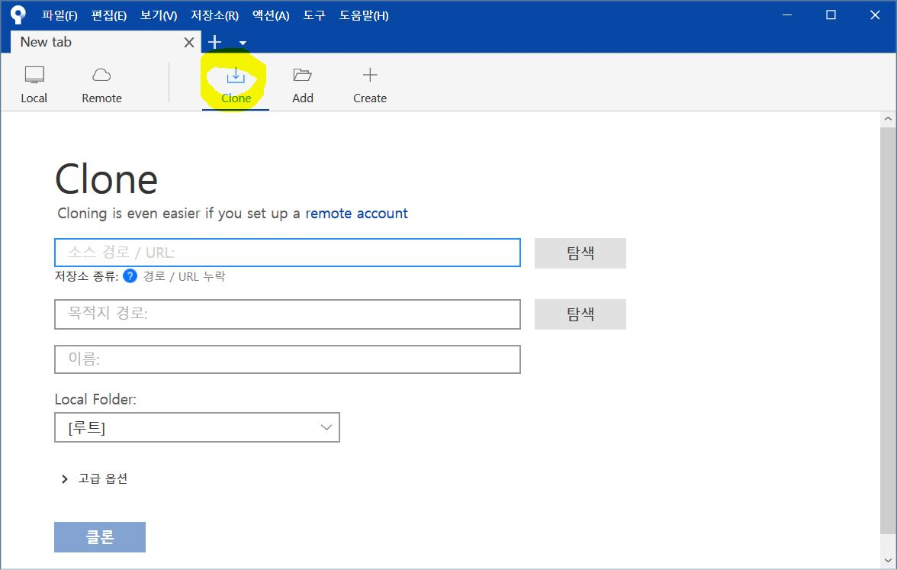
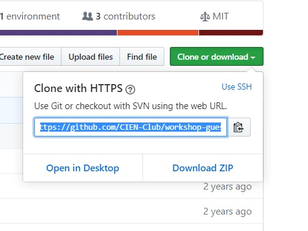
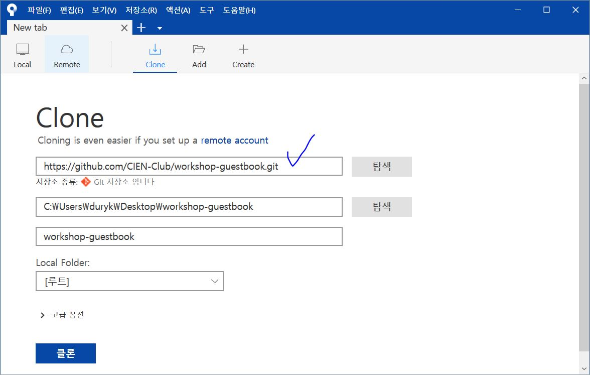
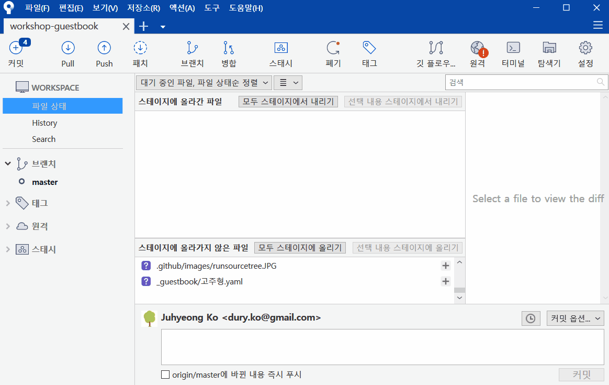
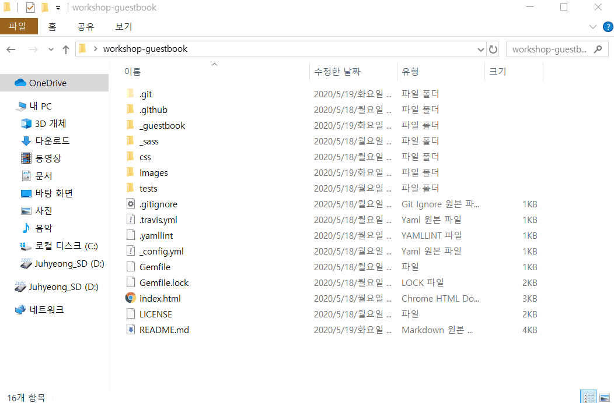
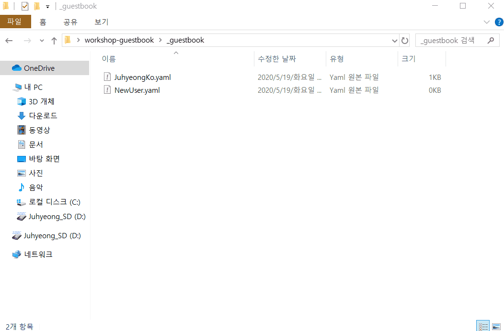
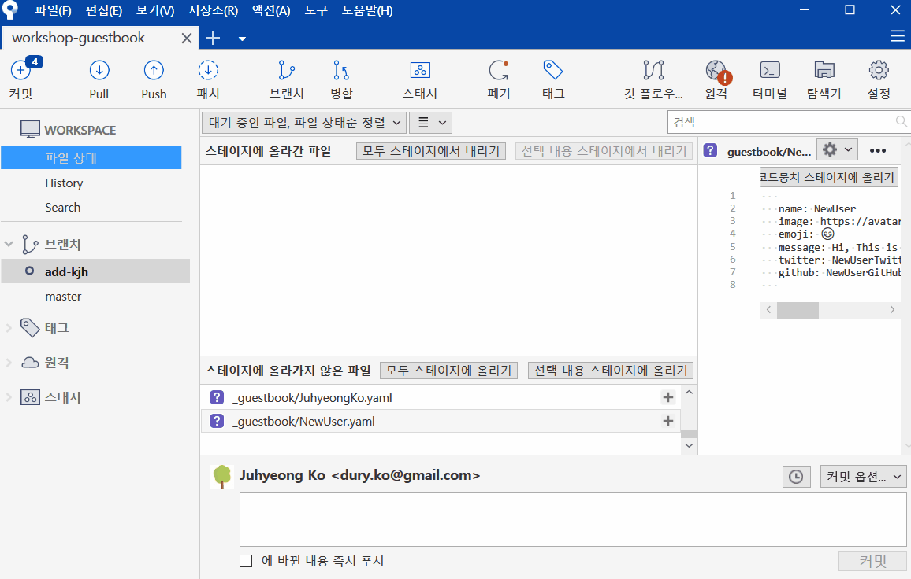
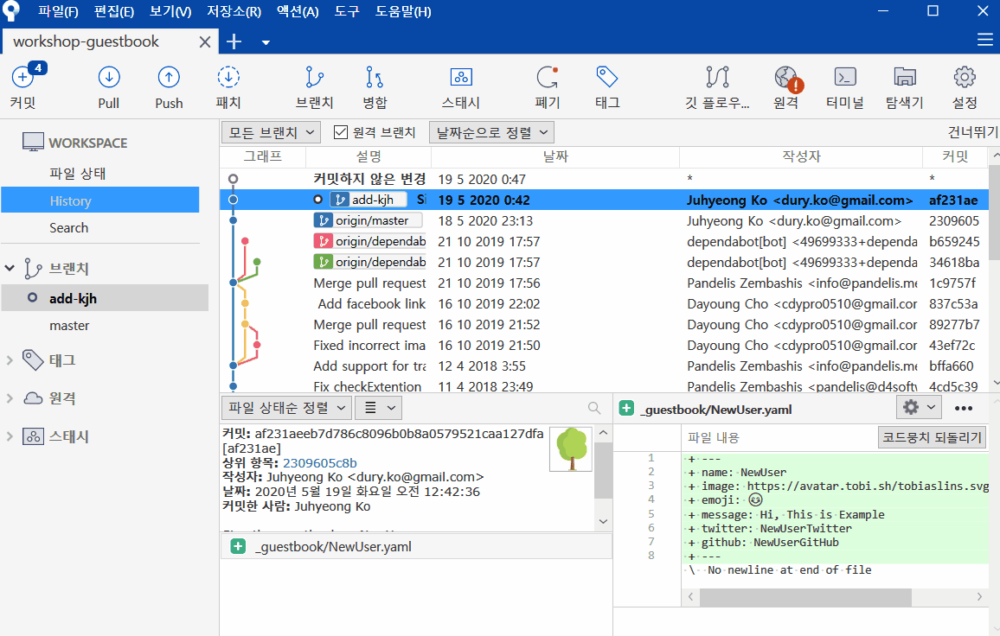

# 방명록 남기기

# SourceTree를 사용해서 방명록을 남겨봅시다 📓

Git과 GitHub를 배운지 2주가 지났지만 코로나19 때문에 만나질 못해서 정작 써먹을 일이 없습니다ㅜㅜ.
Git을 까먹는 것도 방지하고 Branch 만드는 법도 익힐 겸 `방명록 남기기`를 4주차 숙제로 준비했습니다. ㅎㅎ

Branch를 만들어서 방명록을 Commit하는 숙제입니다. 어렵지 않아요!
여러분이 Push한 Branch를 관리자가 승인을 하면 방명록에 자신의 이름이 남겨집니다.
원격 저장소로 여러 사람들과 어떻게 협업하는지 익히고 방명록에 이름을 남겨봅시다.

# 방명록을 남기는 방법

## 1. 관리자(고주형)에게 GitHub 계정명을 보내주세요

> Public인 원격 저장소의 경우, Clone은 아무나 할 수 있지만 Push는 아무나 할 수 없습니다. Push 권한을 얻으려면 그 저장소를 만든 관리자로부터 초대를 받아야 합니다. Push 권한을 주기 위해서 GitHub 사용자명을 저에게 보내주세요:).

## 2. SourceTree를 실행하세요

> 초대를 수락하셨다면 이 저장소에 Commit을 Push할 수 있습니다!
> 이제부터는 SourceTree를 사용해야 합니다.



### Clone

> 이 저장소를 SourceTree에서 Clone 해주세요





### Branch

> 실제로 사용되고 잘 작동하는 코드는 보통 master에 둡니다.
> 안정적인 코드가 있는 master와 분리시켜서 독립적으로 개발을 하기 위한 새로운 Branch를 만들어주세요.

> Branch명은 어떤 작업용인지 알 수 있도록 지어 주세요.



### 방명록을 작성해주세요

복제한 저장소의 `/_guestbook` 폴더로 이동해서 새로운 파일을 만들어주세요. 파일의 이름은 **내이름.yaml**으로 설정해주세요.(내이름.yaml.txt가 아닙니다.) 그 파일 내용으로 아래에 있는 형식을 복사해서 붙여넣어 주세요. *name*와 _image_ 필드를 제외하고는 적고 싶지 않다면 적지 않아도 괜찮습니다.

```
---
name: 고주형
image: https://avatar.tobi.sh/tobiaslins.svg?text=KJH
emoji: 🌴
message: 유니티 수업 잘따라오고 계시나요? ㅎㅎ
twitter: IamGroooooot
github: IamGroooooot
facebook: IamGroooooot
instagram: i-am-groooooot
web: coding-groot.tistory.com
---
```

> 만약 자신의 이미지를 설정하고 싶지 않은 경우, image 링크는 그대로 두시고 링크의 뒤에 영어로 이니셜을 `?text=KJH`와 같이 적어주세요.

> 이모지는 [emojipedia.org](https://emojipedia.org/)에서 찾아서 사용하면 됩니다. 윈도우를 사용하시는 경우 `윈도우키`+`.`를 눌러서 간편하게 이모지를 입력할 수 있습니다.

> `twitter`, `github`, `facebook`, `instagram`, `web`은 있는 경우 채워주세요! `twitter`, `github`, `facebook`, `instagram`는 해당 사이트 아이디로 채워주시면 되고, `web`은 개인 홈페이지가 있을 경우 `https://`를 때고 써주세요.





### Commit

위와 같이 만든 자기의 방명록을 자신이 만든 Branch에 **commit**해주세요.
다른 사람들이 변경/추가된 내용을 쉽게 파악하게 하기 위해서 Commit 메시지는 간단/명료하게 작성해야 합니다.



### Push

원하는 작업을 완료했으면 **origin**(기본 원격 저장소)에 그 변경 사항을 Push해야 합니다. master가 아니라 자신이 만든 Branch명을 선택해서 Push해주세요.



### 축하합니다 :tada:

축하합니다. 여러분은 성공적으로 자신이 작업한 Branch를 Push했습니다. 여러분들이 올린 Commit은 관리자(고주형)가 검토합니다. 만약 올바르게 하셨다면 관리자가 master에 여러분의 Branch를 Merge를 합니다. 여러분의 Commit이 master에 Merge되면 페이지에 방명록이 표시됩니다.
